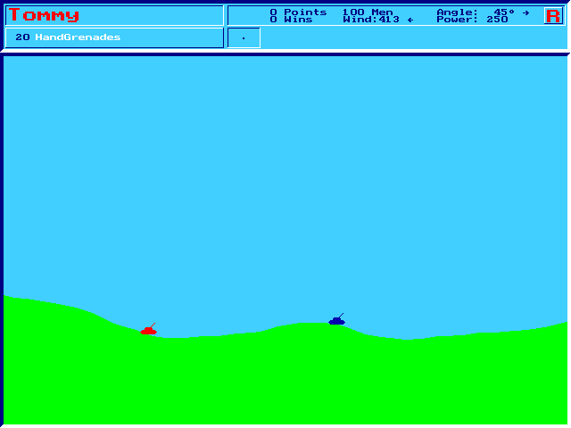

# Tank Wars — HTML5 port

A faithful, from-scratch **HTML5 (Canvas + WebAudio)** reimplementation of the 1995/96 MS‑DOS
artillery game **TankWars V2.07** by Marko Lindner. It is **not an emulator** — every rule,
trajectory, weapon effect, sound, colour and screen layout was reverse‑engineered from the
original and re‑implemented 1:1 in plain JavaScript (no dependencies, no build framework).

Two tanks or more lob shells over procedurally generated terrain, buy weapons between games,
and blow each other up with everything from hand grenades to 5 MT nukes, earthquakes,
chain‑reaction inducers and Captain Caveman.



## Play

Just open **`index.html`** in a modern browser — it is a single self‑contained file
(all code, the font and the docs are inlined). Click once to enable sound.

The modular source under `html5-port/` can also be run directly: serve the folder and open
`html5-port/index.html` (it loads the ES modules in `html5-port/js/`).

## Controls

| Key | Action |
|-----|--------|
| ← / → | Aim angle |
| ↑ / ↓ | Power ± 1 |
| PgUp / PgDn | Power ± 100 |
| Home / End | Power = max / = default (250) |
| Ins / Del | Angle ± 45° |
| **W** / **I** | Snap to 45°/135° · mirror the angle |
| **Tab** | Next weapon |
| **1**‑**0** | Peek at a player's status |
| **Enter** | Fire |
| **Space** | View game status |
| **L** | The Lucky Shots (high‑score table) |
| **F1** | Help page |
| **Esc** | Give up this game |
| Right click | Toggle the on‑screen aiming panel |
| Mouse wheel | Power ± 1 |
| Left click | Aim & fire (or operate the panel / menus) |

The in‑game documentation (bilingual EN/DE, switchable) is reachable from the start screen.

## Project layout

```
index.html            standalone build — open this to play
html5-port/
  index.html          modular dev entry (loads ./js/*.js)
  build.mjs           bundles the modules + docs into the standalone index.html
  package.json
  js/                 the port: vga, palette, font, physics, weapons, ai, hud,
                      terrain, tank, sounds, pcspeaker, rtl (TP7 RNG), main …
PORTIERUNG.md         reverse‑engineering & porting notes (German)
PORTIERUNG.en.md      the same notes (English)
```

## Build

The standalone `index.html` is generated from the modules and the documentation:

```bash
cd html5-port
node build.mjs        # writes ../index.html (and js/doctext.js)
```

No external packages are required.

## Faithfulness

Behaviour is derived 1:1 from the original: the Turbo Pascal 7 random generator, Real48
ballistics (gravity 0.0011, the exact launch scaling), the 16‑colour VGA palette (6‑bit DAC
expansion), the BGI 8×8 font, every weapon's damage/blast model and terrain destruction, the
five computer‑player aiming brains and turn‑order permutation, the shop economy, the PC‑speaker
sound effects, and the exact pixel layout of the menu, shop, status, help, rankings and
name‑entry screens. Details and the deliberate deviations are documented in `PORTIERUNG*.md`.

## Credits & legal

Original game **TankWars V2.07 © Marko Lindner (1995/96)**. This repository is an independent,
non‑commercial fan reimplementation for preservation and learning. **No original game files,
binaries or disassembly are included** — only the newly written port. All trademarks and the
original game belong to their respective owner.
